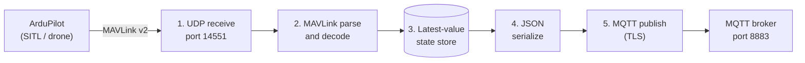

# 1. Install guide
## 1.1 ArduPilot SITL build from source

```bash
# clone with submodules (MAVLink etc. live in modules/, clone doesn't have)
git clone --recurse-submodules https://github.com/ArduPilot/ardupilot.git

cd ardupilot
Tools/environment_install/install-prereqs-ubuntu.sh -y

./waf configure --board sitl
./waf copter
```

## 1.2 QGroundControl (on Ubuntu 22.04)

- Current QGC stable appimage requires Ubuntu 24.04+. On 22.04 use the 5.0.x or 4.4,...
- Pre-run setup:

```bash
sudo apt remove modemmanager -y
sudo usermod -a -G dialout $USER     # then log out/in
sudo apt install libfuse2 -y         # needed for appimage to run on 22.04
chmod +x QGroundControl-x86_64.AppImage
```


## 1.3 C++ build toolchain + libraries

```bash
# install cmake and g++
sudo apt install cmake g++ -y
```

```bash
# get mavlink header files:
cd OIA-MAVLink
cp -r ~/Documents/ardupilot/build/sitl/libraries/GCS_MAVLink/include/mavlink/v2.0/* third_party/mavlink/
```

```bash
# install mosquitto broker and c++ library
sudo apt install mosquitto mosquitto-clients -y
sudo apt install libmosquittopp-dev -y
```

```bash
# install nlohmann/json
sudo apt install nlohmann-json3-dev -y 
```

## 1.4 Build the files
```bash
cd OIA-MAVLink
cmake -B build
cmake --build build
```

## 1.5 Quick install

- With mavlink header files:
```bash
cd OIA-MAVLink
chmod +x install_deps.sh && ./install_deps.sh # install all necessary dependencies
cmake -B build && cmake --build build
./build/OIA_MAVLink_bridge config.conf # path to config file
```

- Without mavlink header files:
```bash
# build ardupilot
git clone --recurse-submodules https://github.com/ArduPilot/ardupilot.git

cd ardupilot
Tools/environment_install/install-prereqs-ubuntu.sh -y

./waf configure --board sitl
./waf copter
# copy the header files over
cd OIA-MAVLink
cp -r path_to/ardupilot/build/sitl/libraries/GCS_MAVLink/include/mavlink/v2.0/* third_party/mavlink/
# then follow the steps above
```

- For testing with a local MQTT broker:
```bash
# after installing all dependencies
chmod +x setup_test_broker.sh && ./setup_test_broker.sh
# then continue running the bridge
```

# 2. Running the bridge

```bash
# pointing the bridge to config file
./build/OIA_MAVLink_bridge your_config.conf # path to config file

# then open a new terminal
cd path/ardupilot/ArduCopter
python3 ../Tools/autotest/sim_vehicle.py --console --map --out=udp:127.0.0.1:14551 # the port that SITL will forward data to the bridge
# if also using QGC then add argument --out=udp:127.0.0.1:14550

# then open a new terminal
cd OIA_MAVLink
./QGroundControl-x86_64.AppImage

# to see mqtt broker, open a new terminal
mosquitto_sub -h localhost -p 8883 --cafile path/certs/ca.crt -u <username> -P <password> -t "drone/#" -v
```

> [!WARNING]
> `broker_ip` must match a name in the broker's TLS certificate (its SAN, or the CN if the certificate has no SAN). If you connect by IP address, the certificate must list that IP, otherwise TLS verification fails and the connection is refused. The test broker's certificate is for `localhost`, so use `localhost` there.

# 3. Architecture

## 3.1 Overview

The bridge is a pipeline: data enters at one end as MAVLink
and leaves at the other end as JSON on an MQTT broker. Each stage
only talks to its neighbours, and the data only flows one way. Nothing is sent back to
the drone.



| Stage | What it does | Where in the code | Thread |
|-------|--------------|-------------------|--------|
| 1. UDP receive | Binds `bind_address:udp_port`, reads datagrams | `mavlink_receive_loop()` | MAVLink thread |
| 2. Parse / decode | Feeds bytes to `mavlink_parse_char`, decodes the messages | `mavlink_receive_loop()` | MAVLink thread |
| 3. State store | Keeps the latest value of every field, guarded by `data_mutex_` | member variables of `DroneBridge` | shared |
| 4. JSON serialize | Builds one telemetry document from the state store | `build_telemetry_payload()` | main thread |
| 5. MQTT publish | Sends the JSON to the broker every `publish_interval` ms | `publish_loop()` + mosquitto | main + mosquitto thread |

A side path runs next to the main pipeline: the **heartbeat watchdog**. Each
`HEARTBEAT` stamps the time into the state store. Before every publish, the main thread
checks the age of that stamp, and if it is older than `heartbeat_timeout` seconds it
sets `online: false`.

**Threads.** The process runs three threads: the main thread (stages 4 and 5, plus the
watchdog), the MAVLink thread (stages 1 and 2), and the mosquitto network thread
(started by `loop_start()`, does the actual MQTT socket I/O, keepalive and reconnects).
The only shared data is the state store, protected by one mutex.

## 3.2 MAVLink

ArduPilot speaks MAVLink v2. Each message is a framed packet: a start byte, a length,
sender IDs (`sysid` / `compid`), a message ID, a payload, and a CRC. The payload layout
for each message ID is defined in the MAVLink headers (`third_party/mavlink/`), which
also provide the decode functions.

The bridge decodes four main messages:

| MAVLink message | Raw field | Raw unit | Converted to | JSON field |
|-----------------|-----------|----------|--------------|------------|
| `HEARTBEAT` | `base_mode` (armed bit) | flag | bool | `armed` |
| | `custom_mode` | ArduCopter mode number | name lookup | `flight_mode`, `flight_mode_num` |
| | (time of arrival) | | watchdog reset | `online` |
| `SYS_STATUS` | `battery_remaining` | % (-1 = unknown) | % or `null` | `battery_state.batteryCharge` |
| | `voltage_battery` | mV | V | `battery_state.voltage` |
| | `current_battery` | cA (0.01 A) | A | `battery_state.current` |
| `GLOBAL_POSITION_INT` | `lat`, `lon` | degrees x 1e7 | degrees | `position.lat`, `position.lon` |
| | `alt` | mm | m | `position.alt` |
| | `vx`, `vy`, `vz` | cm/s (NED) | m/s | `velocity.vn`, `ve`, `vd` |
| `ATTITUDE` | `roll`, `pitch`, `yaw` | rad (-pi..pi) | rad (unchanged) | `attitude.roll`, `pitch`, `yaw` |
| | `rollspeed`, `pitchspeed`, `yawspeed` | rad/s | rad/s (unchanged) | `angular_velocity.rollspeed`, `pitchspeed`, `yawspeed` |

Rates of change:

| Degrees of freedom | Fields | Source |
|--------------------|--------|--------|
| Position (3): where it is | `lat`, `lon`, `alt` | `GLOBAL_POSITION_INT` |
| Orientation (3): how it is tilted and pointing | `roll`, `pitch`, `yaw` (radians) | `ATTITUDE` |
| Linear speed (3): how fast it moves | `vn`, `ve`, `vd` (m/s) | `GLOBAL_POSITION_INT` |
| Angular speed (3): how fast it rotates | `rollspeed`, `pitchspeed`, `yawspeed` (rad/s) | `ATTITUDE` |

Plus `armed`, `flight_mode`, battery and `online` flag for general status.

Notes:
- Velocity is in the NED frame: `vn` north, `ve` east, `vd` down (positive means descending).
- Roll is rotation about the forward axis, pitch about the right-wing axis, yaw about
  the vertical axis (compass heading). Positive yaw is clockwise seen from above, with
  0 at north.
- Angles are in radians. To show degrees, multiply by `180 / pi`.

## 3.3 UDP ports

| Port | Used by | Direction |
|------|---------|-----------|
| 14550 | QGroundControl, which listens here by default | SITL → QGC |
| 14551 | This bridge (`udp_port` in the config) | SITL → bridge |

SITL sends a copy of the same MAVLink stream to each port, so QGC and
the bridge run side by side. If another
program binds the same port as the bridge, one of them will fail to bind or miss
packets, so keep the ports distinct.

## 3.4 MQTT output

Topic prefix: `drone/v2/<manufacturer>/<serial_number>`

| Topic | QoS | Retained | Published |
|-------|-----|----------|-----------|
| `<prefix>/telemetry` | 0 | no | every `publish_interval` ms |
| `<prefix>/connection` | 1 | yes | on connect (`ONLINE`), on clean shutdown (`OFFLINE`), by the broker on abnormal loss (`CONNECTIONBROKEN`, Last Will) |

Telemetry is QoS 0 and not retained because it is frequent and only the latest value is
useful. The connection topic is retained so a late subscriber immediately learns the
current state.

Example telemetry payload:

```json
{
  "header_id": 42,
  "timestamp": "2026-10-09T11:13:12.345Z",
  "version": "1.0.0",
  "manufacturer": "DefaultCorp",
  "serial_number": "drone01",
  "position":         { "lat": -35.3632621, "lon": 149.1652374, "alt": 12.34 },
  "velocity":         { "vn": 0.0, "ve": 0.0, "vd": 0.0 },
  "attitude":         { "roll": 0.0012, "pitch": -0.0034, "yaw": 1.5708 },
  "angular_velocity": { "rollspeed": 0.0, "pitchspeed": 0.0, "yawspeed": 0.0 },
  "battery_state":    { "batteryCharge": 87, "voltage": 12.6, "current": 5.2 },
  "armed": false,
  "flight_mode": "GUIDED",
  "flight_mode_num": 4,
  "online": true
}
```

Two different "online" statuses: 
- `connection_state` (on the connection topic) says
whether the **bridge** is connected to the broker
-  `online` (in the telemetry) says
whether the **drone** is still sending heartbeats.

## 3.5 Project layout

```
OIA-MAVLink/
├── src/
│   ├── drone_bridge.cpp        # config loading, DroneBridge class, MAVLink decode, MQTT publish, main()
│   └── drone_bridge.hpp        # BridgeConfig and DroneBridge declarations
├── third_party/mavlink/        # MAVLink C headers generated by ArduPilot
├── CMakeLists.txt              # builds the OIA_MAVLink_bridge executable (C++17)
├── example_conf.json           # example configuration (JSON content)
├── install_deps.sh             # installs the build dependencies via apt
└── setup_test_broker.sh        # sets up a local TLS mosquitto broker for testing
```

External libraries: the MAVLink headers (frame parsing and decoding), libmosquittopp
(MQTT client with TLS, Last Will and auto-reconnect), and nlohmann/json (config parsing
and payload building).

## 3.6 Configuration


| Key | Type | Meaning | Default if not loaded |
|-----|------|---------|-----------------------|
| `broker_ip` | string | MQTT broker host. Must match the broker certificate (CN / SAN) | `localhost` |
| `broker_port` | int | MQTT broker TLS port | `8883` |
| `username` | string | MQTT username (empty = no authentication) | empty |
| `password` | string | MQTT password | empty |
| `ca_cert_path` | string | CA certificate used to verify the broker (empty = no TLS) | empty |
| `manufacturer` | string | Topic path segment and payload field | `DefaultCorp` |
| `serial_number` | string | Topic path segment, payload field, MQTT client id (`<serial>_drone_bridge`) | `drone01` |
| `version` | string | Schema version string in every payload | `1.0.0` |
| `publish_interval` | int, ms | Telemetry publish period | `1000` |
| `heartbeat_timeout` | int, s | Silence after which the drone is marked `online: false` | `3` |
| `bind_address` | string | Local address the UDP socket binds to | `127.0.0.1` |
| `udp_port` | int | Local UDP port MAVLink arrives on (see 3.3) | `14551` |

# 4. Testing

## 4.1 Verify normal operation

1. Start the bridge (and SITL) as in section 2.
2. In a separate terminal, subscribe to the broker as a test consumer:
```bash
mosquitto_sub -h localhost -p 8883 --cafile path/certs/ca.crt -u <username> -P <password> -t "drone/#" -v
```
3. Confirm telemetry JSON appears on `drone/v2/.../telemetry` .

## 4.2 Connection-loss scenarios

### Kill bridge

- With the bridge running and publishing, kill its process.
- Expected behavior: the broker detects the lost MQTT connection and publishes
  LWT with `connection_state: "CONNECTIONBROKEN"` on the
`.../connection` topic.
- The bridge is gone, so the broker announces it via LWT.

### SITL

- Kill SITL and leave the bridge running.
- Expected behavior: the bridge is alive and MQTT is connected, so the LWT doesn't fire. 
  But after timing out by `heartbeat_timeout` seconds, 
  the watchdog sets `online: false` and the bridge keeps publishing telemetry
  with that flag.
